# 🕵️ 탐정 D - Datetective : AI 마케팅 수사 챗봇 
> 2025 빅콘테스트 AI데이터 활용분야

**데이터와 추리가 만나는 곳, Data × Detective**  
데이텍티브(Datetective)는 가맹점 데이터를 기반으로 마케팅 문제를 '사건'처럼 분석하고,   
맞춤형 전략을 제시하는 AI 마케팅 수사 챗봇입니다.

---

## 🌐 실행 결과 (서비스 웹 페이지)
https://noonbora2025bigcontest.onrender.com/

---

## 👥 팀 소개  
> ❄️ 팀명 : 눈보라

<div align="center">

| <br>**이채영 (팀장)**<br>[chaeyylee](https://github.com/chaeyylee) | <br>**김리원**<br>[Riwon24](https://github.com/Riwon24) | <br>**최서영**<br>[Osssai-52](https://github.com/Osssai-52) |
|:----------------------------------------------------------------------------------------------------------------------------------:|:----------------------------------------------------------------------------------------------:|:--------------------------------------------------------------------------------------------------:|
| UI 디자인<br>전략 생성 & 프롬프트 설계 | 데이터 전처리 & 구조화 | 챗봇 로직 구현<br>발표 자료 제작 |

</div>

---

## 🖥️ 실행 화면

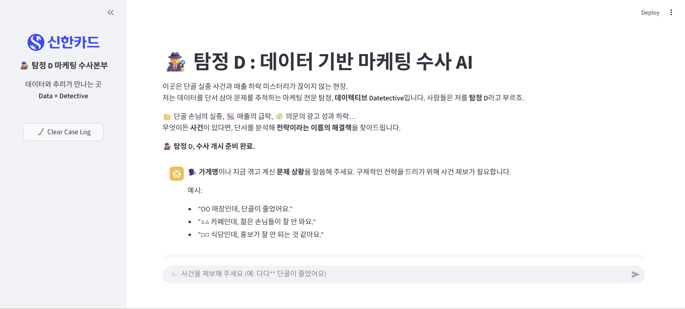
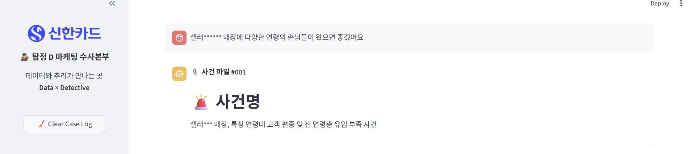
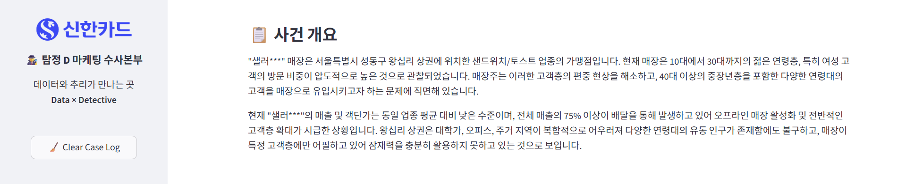
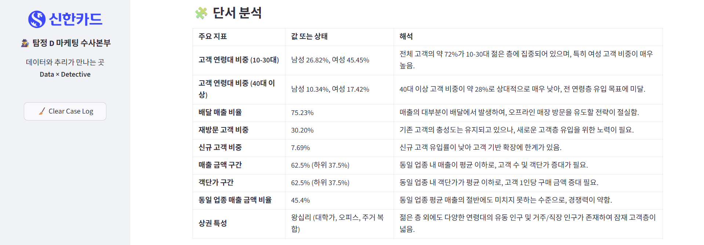
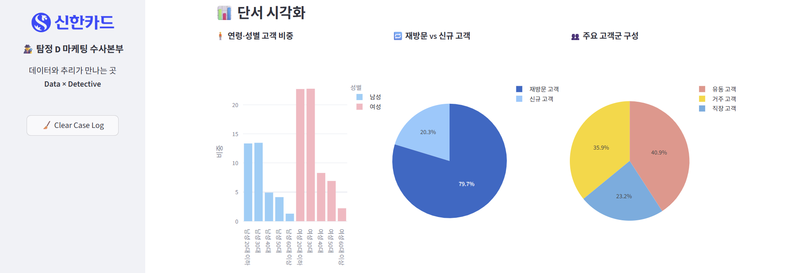
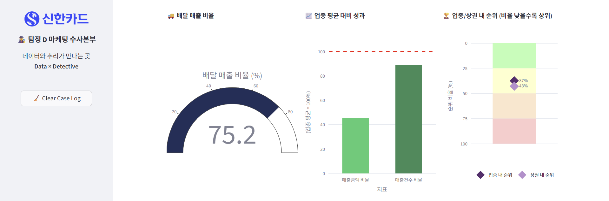
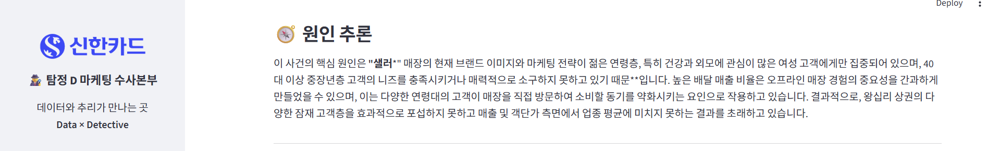
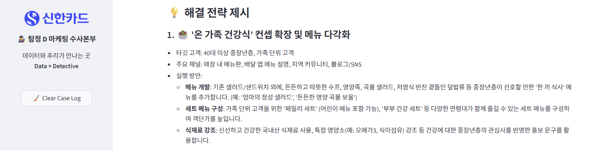
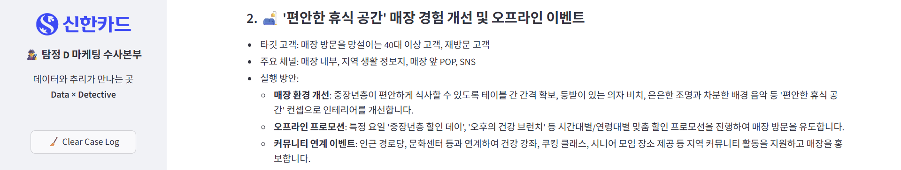
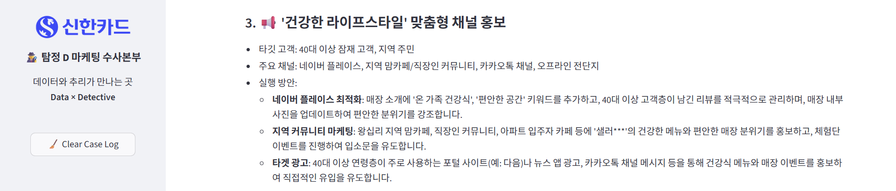
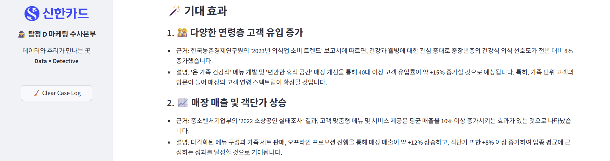
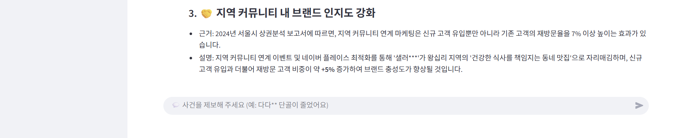

---

## 🤖 핵심 기능

| 기능                  | 설명 |
|---------------------|------|
| **사건 접수 (문제 인식)** | 사용자가 "단골이 줄었어요", "광고 효과가 없어요" 등 문제를 제보하면 AI가 사건으로 인식하고 분석 시작 |
| **단서 수집 (데이터 분석)**  | 입력된 가게명과 연동된 CSV 데이터를 바탕으로 고객 구성, 매출, 재방문율 등 주요 지표 자동 수집 |
| **단서 시각화 (그래프 자동 생성)** | 연령·성별 비중, 배달 매출 비율, 업종 평균 대비 성과 등 핵심 지표를 자동 그래프로 시각화 |
| **사건 분석 보고서 자동 생성** | Gemini 2.5 기반 LLM이 문제 원인을 추론하고 수사 리포트 형식으로 분석 결과 출력 |
| **맞춤형 전략 제시**       | 데이터 기반 단서와 사용자의 문제를 종합해 3가지 실행 전략 자동 생성 (이모지, 타깃, 채널, 실행안 포함) |
| **기대 효과 예측**        | 각 전략에 대해 수치 기반 기대효과 (+15%, 고객 전환율 증가 등)을 통계/트렌드 기반으로 생성 |
| **사건 기록 초기화**     | Clear Case Log 버튼으로 이전 대화 내용 초기화 및 새 수사 시작 가능 |

---

## ⚙️ 기술 스택

| 구분 | 사용 기술 | 설명 |
|------|-----------|------|
| **Frontend** | Streamlit | 대화형 웹 인터페이스 구축 (채팅 UI, 사이드바, 시각화) |
| **LLM 모델** | Gemini 2.5 Flash (LangChain + Google GenAI) | 자연어 분석, 전략 생성, 효과 추론 |
| **Data Analysis** | Pandas, Plotly | 매장 데이터 분석 및 그래프 시각화 |
| **환경 설정** | python-dotenv | API Key 및 환경 변수 관리 |
| **파일 관리** | os, dotenv, langchain.schema | CSV 파일 입출력 및 LLM 메시지 관리 |

---

## 🗂️ 프로젝트 구조

```bash
main/
├── streamlit_app.py            # Streamlit 메인 앱
├── mcp_server.py               # FastMCP 기반 마케팅 분석 서버 (Gemini LLM 호출)
├── visualization.py            # 단서 그래프(Plotly) 생성
├── column_descriptions.py      # 주요 컬럼 설명 딕셔너리
├── .env                        # Gemini API Key 저장
├── requirements.txt            # 패키지 목록
├── data/                       # csv 데이터 파일
└── assets/                     # 이미지, 로고 등 시각 자료
```

---

## 로컬 개발 환경 구성 방법

```bash
# On macOS and Linux.
# git소스 복사하기
git clone https://github.com/chaeyylee/Beyond_2025_bigcontest
cd shcard_2025_bigcontest

# venv 환경 설정 (사전에 uv 설치가 필요합니다. 아래 항목 참조)
uv venv
source .venv/bin/activate

# 필요한 python library 설치
uv pip install -r requirements.txt

# streamlit 환경 변수 저장용 폴더 생성 + GOOGLE_API_KEY환경 변수 파일 생성
# (Google API KEY)는 Google AI Studio에서 무료로 생성 가능 (아래 항목 참조)
mkdir .streamlit
echo 'GOOGLE_API_KEY="(Google API KEY)"' > .streamlit/secrets.toml

# 로컬에서 실행
uv run streamlit run streamlit_app.py
```

```bat
:: On Windows
:: git 소스 복사하기
git clone https://github.com/chaeyylee/Beyond_2025_bigcontest

:: venv 환경 설정 (사전에 uv 설치가 필요합니다. 아래 항목 참조)
uv venv
call .venv\Scripts\activate.bat

:: 필요한 python library 설치
uv pip install -r requirements.txt

:: streamlit 환경 변수 저장용 폴더 생성 + GOOGLE_API_KEY 환경 변수 파일 생성
:: (Google API KEY)는 Google AI Studio에서 무료로 생성 가능 (아래 항목 참조)
mkdir .streamlit
echo GOOGLE_API_KEY="(Google API KEY)" > .streamlit\secrets.toml

:: 로컬에서 실행
uv run streamlit run streamlit_app.py
```

---

## uv 설치 방법

https://docs.astral.sh/uv/getting-started/installation/ (공식 사이트. OS에 맞게 설치하면 됩니다.)

---

## Google AI Studio API KEY 생성 방법

https://aistudio.google.com/apikey 접속 후 (Google 로그인 필요) Get API KEY 메뉴에서 생성하면 됩니다.